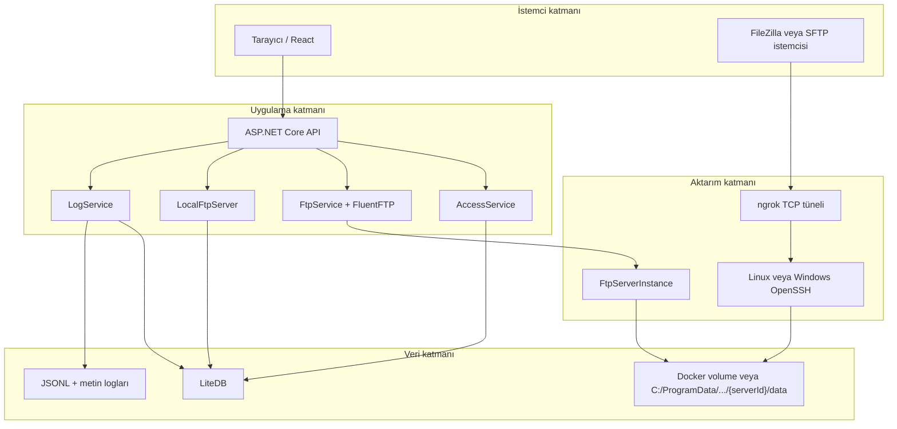
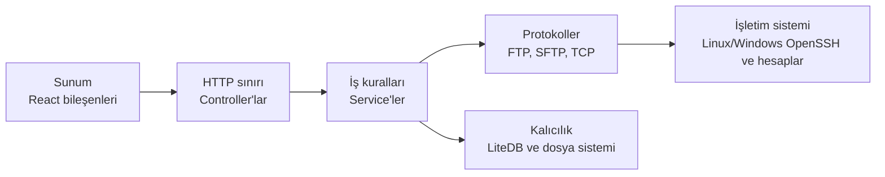
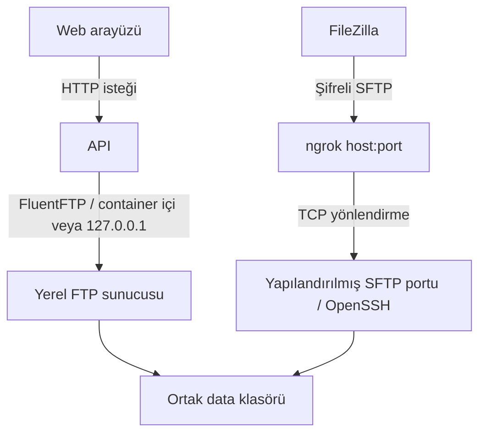
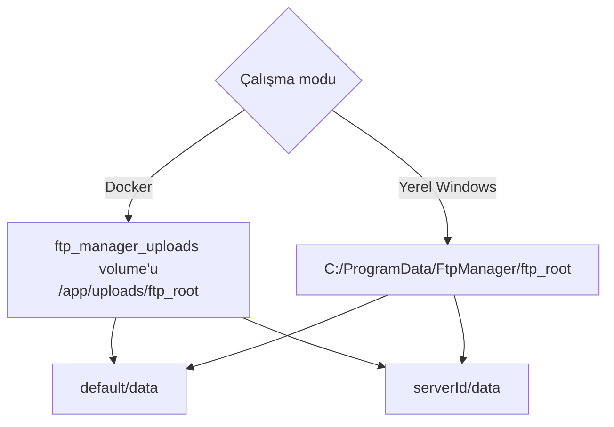
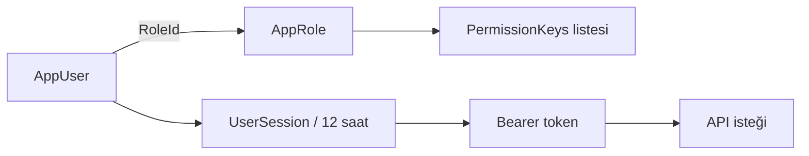
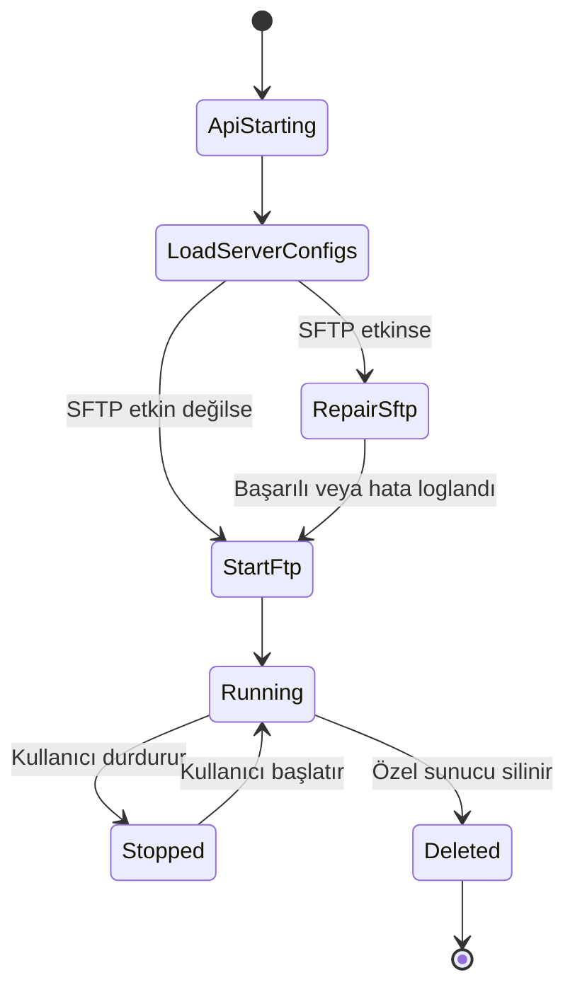
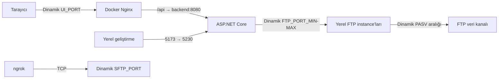
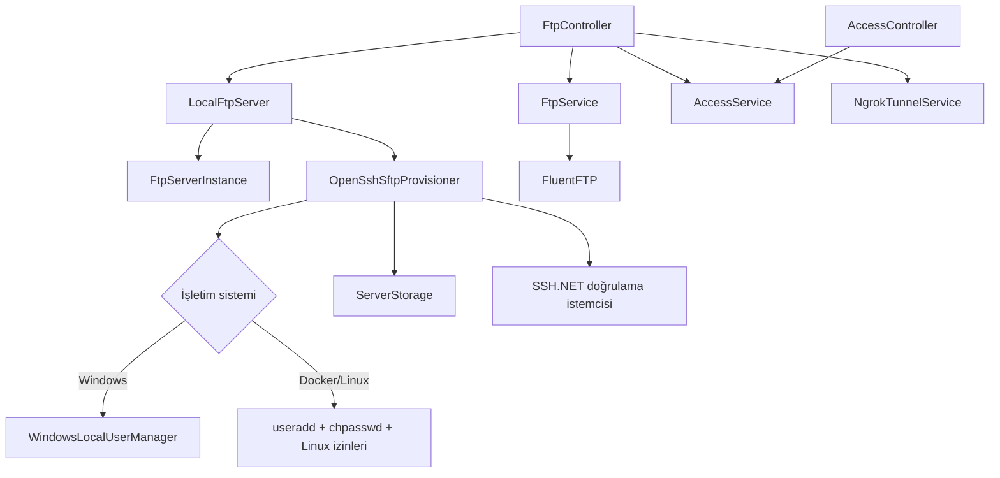

# Sistem Mimarisi

## 1. Büyük resim

Projeyi bir **kargo merkezi** gibi düşünebilirsiniz:

- React arayüzü müşterinin işlem yaptığı gişedir.
- ASP.NET Core API, talebi kontrol edip doğru birime yönlendiren merkezdir.
- `FtpService`, merkez ile FTP deposu arasında çalışan kurye aracıdır.
- `FtpServerInstance`, uygulamanın kendi bünyesinde açtığı FTP şubesidir.
- OpenSSH, aynı depoya açılan güvenli ve şifreli ikinci kapıdır.
- ngrok, bu güvenli kapıya internetten ulaşan geçici bir adres tabelasıdır.
- LiteDB, kullanıcılar, roller, oturumlar, sunucular ve loglar için küçük yerel kayıt dolabıdır.



## 2. Katmanlar ve sorumluluk sınırları



| Katman | Ana dosyalar | Sorumluluk |
| --- | --- | --- |
| Sunum | `App.jsx`, `components/*.jsx` | Kullanıcı etkileşimi, görünüm ve istemci durumu |
| HTTP | `FtpController`, `AccessController` | İstekleri almak, yanıt ve hata kodu üretmek |
| İş kuralları | `AccessService`, `LocalFtpServer`, `FtpService` | Yetki, sunucu yaşam döngüsü ve dosya işlemleri |
| Protokol | `FtpServerInstance`, `OpenSshSftpProvisioner`, `NgrokTunnelService` | FTP komutları, SFTP yapılandırması ve TCP tüneli |
| Kalıcılık | `ServerStorage`, LiteDB kullanan servisler | Dosya dizilimi, kullanıcı/sunucu/log kayıtları |

## 3. FTP, SFTP ve ngrok birbirinden nasıl ayrılır?



Önemli sonuçlar:

- Web arayüzü mevcut sürümde doğrudan SFTP istemcisi değildir; dosya işlemlerini FTP üzerinden yapar.
- FileZilla SFTP ile bağlandığında aynı fiziksel `data` klasörünü görür.
- Web arayüzündeki FTP kökü `/`, SFTP tarafında `/data` olarak görünür.
- ngrok dosya saklamaz, kullanıcı hesabı oluşturmaz ve FTP'yi SFTP'ye dönüştürmez. Yalnızca bir TCP bağlantısını taşır.

## 4. Depolama modeli



LiteDB ve loglar Docker'da `ftp_manager_logs`, FTP/SFTP dosyaları `ftp_manager_uploads`, OpenSSH anahtarları ve yapılandırması `ftp_manager_ssh` volume'ünde tutulur. Container yeniden oluşturulsa da bu volume'ler korunur. Yerel Windows modunda veritabanı ve loglar proje altındaki `Backend/FtpManager.Api/logs`, güvenli FTP kökü ise `C:/ProgramData/FtpManager/ftp_root` konumundadır.

Her sunucu kendi kimliği altında ayrılır. `ServerStorage.EnsureLayout` şu sözleşmeyi korur:

```text
ftp_root/
└── {serverId}/              # SFTP chroot; kullanıcı burada yazamaz
    └── data/                # FTP kökü ve SFTP yazılabilir alanı
```

Bu ayrım güvenlik içindir. Chroot kökü yazılabilir olursa kullanıcı kendi hapishane duvarını değiştirebilir; bu nedenle yalnızca `data` yazılabilir.

## 5. Kimlik ve yetki modeli



| Kimlik türü | Saklandığı yer | Kullanıldığı yer |
| --- | --- | --- |
| Uygulama kullanıcısı | LiteDB `users` | Panel girişi ve rol tabanlı özellikler |
| Uygulama oturumu | LiteDB `sessions` | `Authorization: Bearer ...` |
| FTP hesabı | LiteDB `servers` | FluentFTP ve yerel FTP `USER/PASS` |
| SFTP hesabı | LiteDB + Docker Linux hesabı veya Windows yerel hesabı | OpenSSH parola doğrulaması |

## 6. Süreç ve servis yaşam döngüsü



`LocalFtpServer` hem singleton servis hem de `BackgroundService` olarak çalışır. API başlarken aktif sunucuları LiteDB'den okur, gerekiyorsa SFTP ayarlarını tazeler ve her biri için bir `FtpServerInstance` başlatır.

## 7. Ağ kapıları



Docker portları ilk çalıştırmada boş bloklardan seçilip `.docker/runtime.env` dosyasına yazılır; sonraki başlatmalarda aynı değerler kullanılır. Yerel geliştirme varsayılanları Vite için `5173`, API için `5230`, ilk FTP instance'ı için `2121`, SFTP için `2222` ve pasif veri kanalı için `50000–51000` aralığıdır. FTP her iki modda da kontrol ve veri olmak üzere iki kanal kullanır; SFTP tek SSH bağlantısı üzerinden çalışır.

## 8. Bağımlılık yönü



Bu diyagram, bir hata gördüğünüzde nereden başlamanız gerektiğini de söyler. Örneğin FileZilla parolayı kabul edip klasörü açamıyorsa `NgrokTunnelService` yerine `OpenSshSftpProvisioner` incelenir; Docker'da Linux sahiplik/chroot ayarları, yerel Windows'ta NTFS ACL katmanı kontrol edilir.
