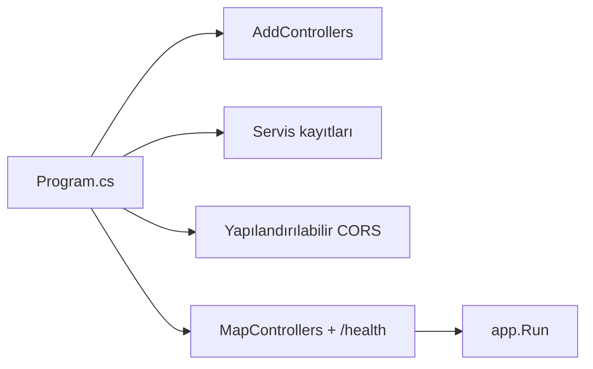
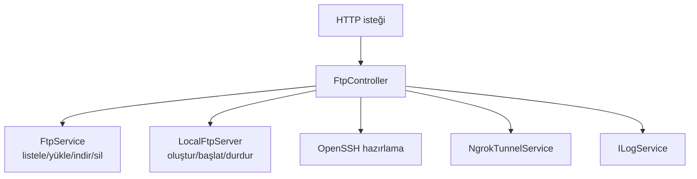
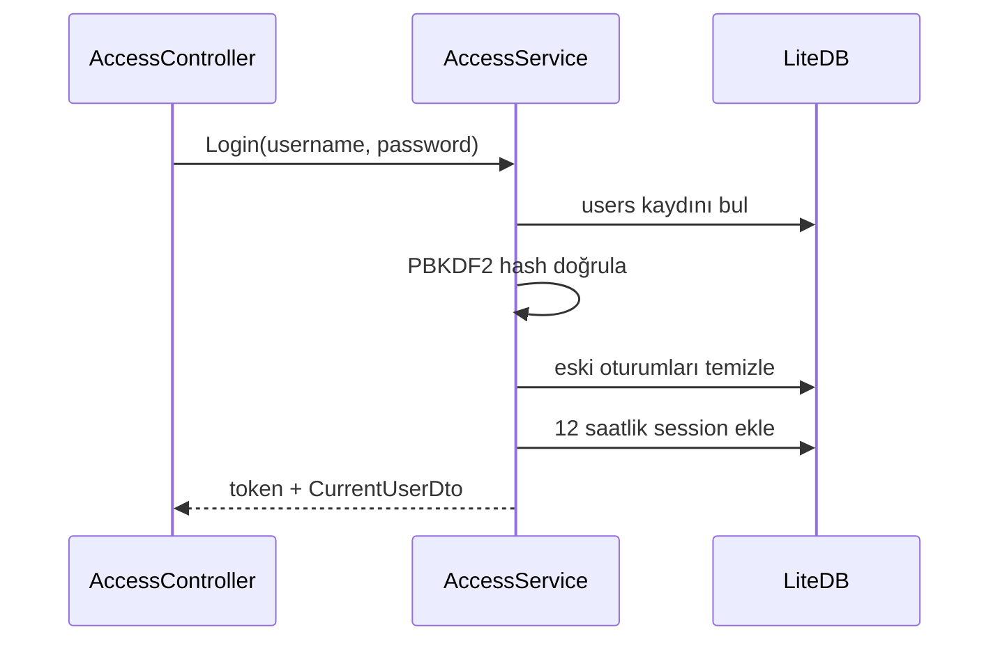
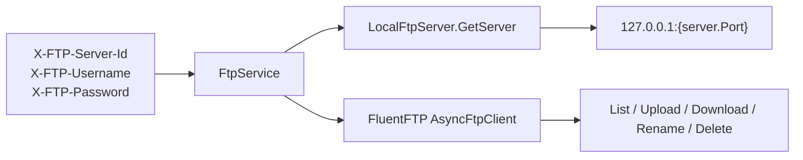
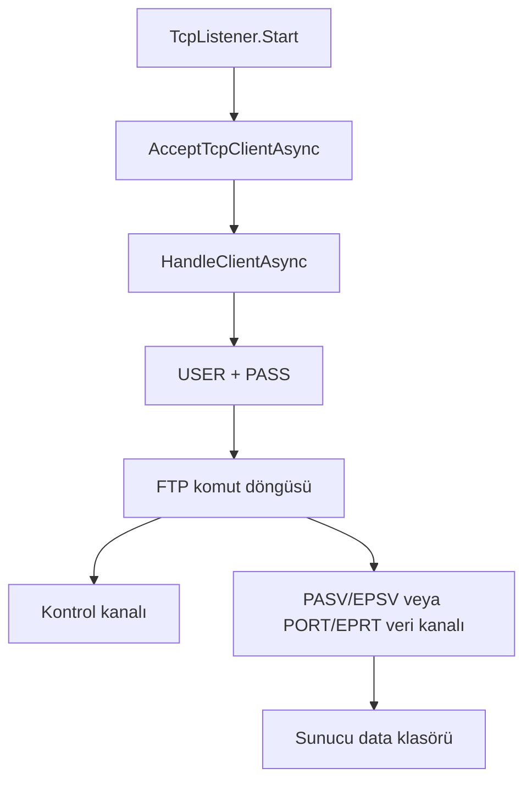
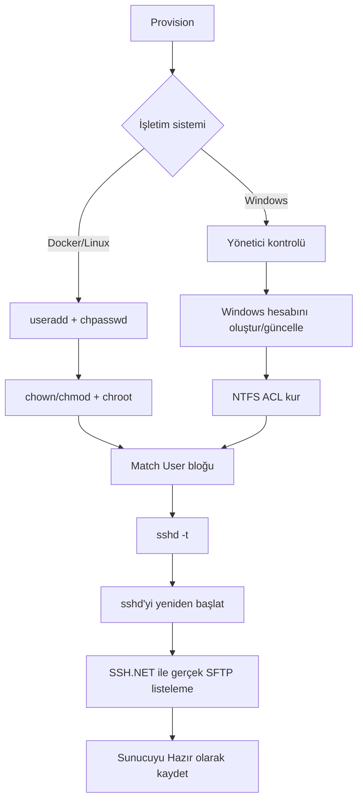
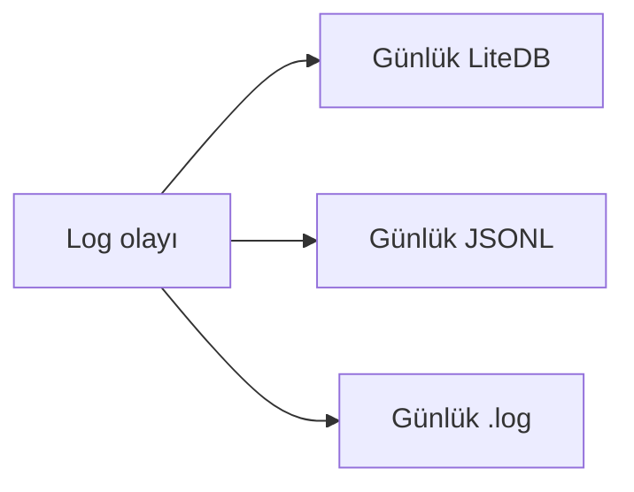
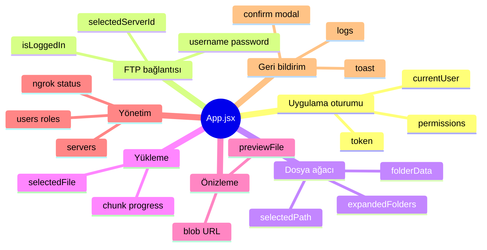

# Kod ve Servis Rehberi

> Guncel guvenlik ve denetim davranisi: Dosya islemlerinde `ILogService`, HTTP oturumundaki aktor kullaniciyi ve rolunu otomatik kaydeder; bu nedenle oturumlu yukleme, indirme, silme ve tasima satirlarinda `Username`/`RoleName` bos kalmaz. Parca yuklemeleri guvenli `uploadId` dogrulamasindan gecer; keyfi `X-FTP-Host` hedefleri engellenir. Ilk kurulum sabit parola kullanmaz, eski `admin123` hesabi zorunlu parola degisimi ister. Giris denemeleri IP basina dakikada bes ile; yukleme ve geri yukleme 2 GB ile; ZIP acilimi 10.000 dosya ve 4 GB ile sinirlidir.

Bu belge kaynak kodunu **dosya dosya** açıklar. Amaç her satırı Türkçeye çevirmek değil; her sınıfın sorumluluğunu, girdisini, çıktısını, bağımlılıklarını ve hata etkisini öğretmektir.

## 1. Backend başlangıcı

### `Program.cs`

Uygulamanın kompozisyon köküdür. Servisleri dependency injection kabına kaydeder, CORS politikasını kurar, controller rotalarını ve Docker health endpoint'ini açar.

| Kayıt | Yaşam süresi | Neden? |
| --- | --- | --- |
| `ILogService → LogService` | Singleton | Bütün uygulama ortak log yazıcısını kullanır |
| `AccessService` | Singleton | Oturum/yetki verisi ve LiteDB erişimi ortak yönetilir |
| `OpenSshSftpProvisioner` | Singleton | Linux/Windows OpenSSH ve hesap işlemleri merkezi yürür |
| `NgrokTunnelService` | Singleton | Tek ngrok süreci ve tünel durumu izlenir |
| `LocalFtpServer` | Singleton + HostedService | Sunucu instance kayıtları bellekte korunur ve arka planda çalışır |
| `FtpService` | Scoped | Her HTTP isteğinin header'larından ayrı bağlantı bilgisi üretir |

### Yapılandırma dosyaları

- `appsettings.json`: Varsayılan FTP host, port ve kimlik bilgileri; ASP.NET log seviyesi.
- `appsettings.Development.json`: Geliştirme ortamına özel ayarlar.
- `Properties/launchSettings.json`: `dotnet run` için `http://localhost:5230` ve HTTPS profilleri.
- `FtpManager.Api.csproj`: Platform bağımsız .NET 10 hedefi ve FluentFTP, LiteDB, SSH.NET bağımlılıkları.
- `FtpManager.Api.http`: Elle API denemeleri için örnek HTTP dosyası.
- `Backend/FtpManager.Api/Dockerfile`: API'yi yayınlar; OpenSSH, curl ve ngrok içeren Linux runtime imajını üretir.
- `compose.yaml`: Backend environment değişkenlerini, port eşlemelerini, healthcheck'i ve kalıcı volume'leri tanımlar.
- `.docker/runtime.env`: `scripts/docker.ps1` tarafından yerelde üretilen Compose proje adı ve port seçimleri; Git'e eklenmez.

## 2. Controller'lar

### `AccessController.cs`

Web panelinin kimlik ve yetki yönetimi kapısıdır. İş kuralını kendi içinde uygulamak yerine `AccessService` çağırır.

| Metot | Görev |
| --- | --- |
| `Login` | Kullanıcı adı/parola ile uygulama oturumu açar |
| `Me` | Token'ın bağlı olduğu güncel kullanıcıyı döndürür |
| `Permissions` | Tanımlı izin kataloğunu döndürür |
| `Get/Create/Update/DeleteRole` | Rol CRUD işlemleri |
| `Get/Create/Update/DeleteUser` | Kullanıcı CRUD işlemleri |

Değişiklik yapan işlemler `ILogService` ile aktör kullanıcı ve rol bilgisini kaydeder.

### `FtpController.cs`

Dosya, FTP sunucusu, SFTP ve ngrok işlemlerinin HTTP kapısıdır.

Önemli bölümler:

- Küçük yükleme `upload`, dosyayı doğrudan FTP'ye yollar.
- Parçalı yükleme `upload-chunk`, parçaları `uploads/temp` altında birleştirip tek akış olarak FTP'ye yollar.
- `rename` hem yeniden adlandırma hem taşıma için kullanılır.
- Sunucu endpoint'leri `servers.manage` gibi izinleri kontrol eder.
- Kimlik bilgilerini görme izni yoksa FTP ve SFTP parolaları yanıttan temizlenir.

## 3. Modeller

### `AccessModels.cs`

| Tip | Anlamı |
| --- | --- |
| `PermissionKeys` | Sistemdeki sabit izin anahtarları ve kullanıcı etiketleri |
| `AppRole` | Rol adı, açıklaması ve izin listesi |
| `AppUser` | Uygulama kullanıcısı; parola hash ve salt olarak tutulur |
| `UserSession` | Rastgele token, kullanıcı bağı ve 12 saatlik sona erme zamanı |
| `CurrentUserDto` | Oturum açmış kullanıcıya gönderilen rol/izin görünümü |
| `UserDto` | Yönetim ekranı için parolasız kullanıcı görünümü |
| `LoginRequest/Response` | Giriş isteği ve token yanıtı |
| `SaveUserRequest/SaveRoleRequest` | CRUD istek gövdeleri |

### `FtpServerConfig.cs`

Bir yönetilen FTP sunucusunun kalıcı ayarlarını taşır:

- Kimlik: `Id`, `Name`
- FTP bağlantısı: `Host`, `Port`, `Username`, `Password`
- Yaşam döngüsü: `IsActive`, hesaplanan `IsRunning`
- Host uyarısı: `HostWarning`
- SFTP: kullanıcı, parola, etkinlik, durum ve yerel SSH portu

### `FtpItemDto.cs`

FTP listesindeki tek dosya veya klasörü temsil eder: ad, tam uzak yol, klasör olup olmadığı, boyut ve değiştirilme tarihi.

### `SftpModels.cs`

`SftpTunnelStatus`, ngrok tünelinin çalışıp çalışmadığını, uygulamanın mı başlattığını, yerel portu ve dış host/portu taşır.

## 4. Ana servisler

### `AccessService.cs`

Uygulama hesabı, oturum, rol ve izin motorudur.

Önemli metotlar:

| Metot | Ne yapar? |
| --- | --- |
| `Initialize` | İlk roller ve `admin` kullanıcısını oluşturur |
| `Login` | Parolayı doğrular, oturum üretir |
| `GetCurrentUser` | Bearer token'ı okuyup kullanıcıyı bulur |
| `RequirePermission` | İzin yoksa işlemi durdurur |
| `HasPermission` | Koşullu görünüm/maskeleme için bool döndürür |
| Rol/kullanıcı CRUD | Sistem rolleri ve admin hesabı için koruma kuralları uygular |
| `HashPassword` | PBKDF2-SHA256, rastgele salt ve 100.000 tur kullanır |

### `FtpService.cs`

API'nin FTP istemcisidir; FluentFTP kullanır. Her HTTP isteğinde seçilen sunucuyu ve kullanıcı tarafından girilen FTP kimlik bilgilerini header'lardan alır.

Yönetilen yerel sunucularda istemci daima loopback kullanır. Bu sayede dış DNS veya NAT hairpin sorunu web arayüzündeki dosya işlemlerini bozmaz.

### `LocalFtpServer.cs`

FTP sunucularının yöneticisidir. İsim yanıltıcı olabilir: tek bir sunucu değil, birden fazla `FtpServerInstance` nesnesini yönetir.

Sorumlulukları:

- LiteDB `servers` koleksiyonunu başlatmak.
- Aktif sunucuları uygulama açılışında ayağa kaldırmak.
- Instance'ları `ConcurrentDictionary` içinde tutmak.
- Host ve port doğrulamak.
- Sunucu oluşturmak, başlatmak, durdurmak ve silmek.
- Depolama dizilimini hazırlamak.
- SFTP hazırlama/deprovision işlemini çağırmak.
- Docker'da `/app/uploads` volume'ünü; Windows yönetici modunda güvenli ProgramData deposunu; normal yerel modda eski proje deposunu seçmek.
- Docker port aralığında boş FTP portunu otomatik atamak ve elle girilen portu ayrılmış aralıkla doğrulamak.

### `FtpServerInstance.cs`

`TcpListener` tabanlı gerçek yerel FTP sunucusudur. Her instance bir host/port dinler ve her istemciyi ayrı görevde işler.

Desteklenen başlıca komutlar:

| Grup | Komutlar |
| --- | --- |
| Oturum | `USER`, `PASS`, `QUIT` |
| Yetenek/durum | `SYST`, `FEAT`, `OPTS`, `PWD`, `TYPE` |
| Veri kanalı | `PASV`, `EPSV`, `PORT`, `EPRT` |
| Dizin | `CWD`, `CDUP`, `MKD`, `RMD`, `LIST`, `NLST`, `MLSD` |
| Dosya | `STOR`, `RETR`, `DELE`, `SIZE`, `MDTM` |
| Taşıma | `RNFR`, `RNTO` |

`NormalizePath` sanal FTP yolunu normalize eder. `IsWithinFtpRoot`, fiziksel yolun izin verilen kökün dışına çıkmasını engeller. Bu ikisi path traversal savunmasının merkezidir.

Docker modunda listener tüm container arayüzlerinde açılır; hosta yalnızca Compose tarafından seçilen `127.0.0.1` portları yayınlanır. Pasif port aralığı `FTP_PASSIVE_PORT_MIN/MAX`, dışarı ilan edilecek IPv4 ise gerektiğinde `FTP_ADVERTISED_HOST` environment değişkeninden okunur.

### `ServerStorage.cs`

Dosya deposunun biçimini korur:

- Yerel Windows modunda güvenli kökü `C:/ProgramData/FtpManager/ftp_root` olarak hesaplar; Docker modunda aynı `{serverId}/data` sözleşmesi `/app/uploads/ftp_root` volume'ü altında korunur.
- Eski proje içi depodan güvenli köke, var olan dosyanın üzerine yazmadan kopyalar.
- Her sunucu için `{serverId}/data` düzenini oluşturur.
- Chroot kökünde kalmış eski dosyaları `data` altına taşır.

### `OpenSshSftpProvisioner.cs`

SFTP özelliğinin orkestratörüdür.

Kritik metotlar:

- `ProvisionLinux`: Docker kullanıcısını/parolasını, chroot sahipliğini ve container içindeki özel sshd yapılandırmasını yönetir.
- `ConfigureDirectoryPermissions`: Windows chroot atalarında yazmayı kapatır; SFTP kullanıcısına geçiş/okuma, `data` içine Modify verir.
- `UpsertManagedMatchBlock`: Kullanıcıya özel `Match User`, `ChrootDirectory` ve `ForceCommand internal-sftp -d /data` bloğunu ekler/günceller.
- `ValidateSshdConfiguration`: Bozuk config ile servisin kapanmasını önlemek için `sshd -t` çalıştırır.
- `ValidateSftpSession`: Parola doğrulaması yetmez; gerçek SFTP alt sistemi ve dizin listeleme de sınanır.
- `Deprovision`: Çalışma moduna göre Match bloğunu ve Linux veya Windows hesabını kaldırır.

### `WindowsLocalUserManager.cs`

Komut satırı yerine Windows NetAPI ve Logon API'lerini P/Invoke ile çağırır.

- `NetUserGetInfo`: Hesap var mı, bayrakları ne?
- `NetUserAdd`: Yeni kısıtlı yerel hesap.
- `NetUserSetInfo`: Parola güncelleme ve kilit/disable temizleme.
- `NetUserDel`: SFTP hesabını kaldırma.
- `LogonUser`: Üretilen parolanın gerçekten Windows tarafından kabul edildiğini doğrulama.

### `NgrokTunnelService.cs`

OpenSSH portuna TCP tüneli açar ve ngrok'un yerel yönetim API'sinden gerçek dış adresi bulur.

| Metot | Davranış |
| --- | --- |
| `GetStatusAsync` | `127.0.0.1:4040/api/tunnels` üzerinden mevcut tüneli keşfeder |
| `StartAsync` | Önce yerel SSH portunu test eder, sonra `ngrok tcp 127.0.0.1:{port}` başlatır |
| `StopAsync` | Yalnızca uygulamanın sahip olduğu süreci durdurur; harici tüneli zorla kapatmaz |
| `CaptureNgrokOutput` | JSON loglarındaki hatayı kullanıcı durumuna taşır |
| `Dispose` | Süreç, HttpClient ve semaphore kaynaklarını kapatır |

### `ILogService.cs` ve `LogService.cs`

Tek olay üç farklı biçimde saklanır:

Bu yapı insan okuması, makine işlemesi ve arayüz görüntülemesi için aynı olayı farklı formatlarda sunar. Yazma işlemleri ortak kilitle korunur.

## 5. Frontend dosyaları

### `main.jsx`

React kökünü oluşturur, `App` bileşenini `StrictMode` altında render eder.

### `App.jsx`

Frontend'in ana orkestratörüdür. Çok sayıda state ve handler burada bulunur:

Öne çıkan işlevler:

- `handleAppLogin`: Uygulama token'ını alır ve localStorage'a kaydeder.
- `fetchFtpServers/fetchFolder/fetchLogs`: Backend verisini getirir.
- `getUploadTargetPath`: Dosya seçiliyse parent klasörü, klasör seçiliyse o klasörü hedefler.
- `handleUpload`: Küçük dosyada tek istek, büyük dosyada parça döngüsü kullanır.
- `handleMoveItem` ve `handleRenameItem`: Aynı backend rename endpoint'ini farklı amaçlarla kullanır.
- `handlePreviewFile`: Blob indirir; metin/CSV, görsel veya PDF görünümüne dönüştürür.
- SFTP/ngrok handler'ları: hazırlama, tünel açma/kapama ve bağlantı bilgisi kopyalama.

### Bileşen kataloğu

| Dosya | Sorumluluk |
| --- | --- |
| `AccessLogin.jsx` | Uygulama hesabı giriş formu ve giriş hatası bildirimi |
| `Header.jsx` | Görünüm sekmeleri, kullanıcı/rol özeti ve çıkış |
| `Sidebar.jsx` | FTP sunucusu seçimi, FTP kimlik girişi, arama ve dosya ağacı kabuğu |
| `FolderTree.jsx` | Rekürsif klasör/dosya görünümü, seçim, sürükleyerek taşıma ve öğe eylemleri |
| `UploadPanel.jsx` | Dosya seçme/sürükle-bırak, yükleme ilerlemesi ve log bölümü |
| `PreviewPanel.jsx` | Metin, CSV, resim ve PDF önizleme |
| `LogViewer.jsx` | JSONL/LiteDB log sekmeleri ve genişletilebilir JSON ayrıntısı |
| `ServerManager.jsx` | FTP sunucusu CRUD, çalışma durumu, SFTP hazırlama ve ngrok kontrolleri |
| `AccessManager.jsx` | Kullanıcı ve rol/izin CRUD ekranı |
| `ConfirmModal.jsx` | Silme gibi yıkıcı işlemler için iki aşamalı onay |

### `services/api.js`

Dosya operasyonları için küçük bir Axios wrapper'ıdır. Ancak ana `App.jsx` birçok isteği doğrudan Axios ile yaptığı için bu dosya henüz bütün API trafiğinin tek merkezi değildir.

API kökü `VITE_API_ROOT` ile değiştirilebilir; değer verilmezse `/api` kullanılır. Docker Nginx bu yolu `backend:8080` adresine proxy eder. Yerel Vite geliştirmede gerekirse `VITE_API_ROOT=http://localhost:5230/api` tanımlanır.

### Stil ve araç dosyaları

- `App.css`: Uygulamaya özel stiller.
- `index.css`: Global CSS giriş noktası.
- `vite.config.js`: Vite ve React/Tailwind eklentileri.
- `tailwind.config.js`: Tailwind tarama/tema ayarları.
- `eslint.config.js`: Kod kalitesi kuralları.
- `index.html`: React'in bağlandığı HTML kabuğu ve ikon/font kaynakları.

## 6. Mevcut teknik borçlar ve sınırlar

Bu bölüm “kod böyle çalışıyor” ile “ideal güvenli üretim sistemi” arasındaki farkı açıkça gösterir:

1. Bazı dosya ve log endpoint'lerinde backend seviyesinde açık `RequirePermission` çağrısı yoktur; yalnızca arayüz gizlemesine güvenilmemelidir.
2. FTP sunucu parolaları ve SFTP parolaları LiteDB'de geri okunabilir biçimde tutulur.
3. Yerel FTP sunucusu `anonymous` kullanıcı adına parola kontrolü olmadan izin verir; üretim için kapatılması gerekir.
4. Uygulama token'ı localStorage'da tutulur; XSS riskine karşı HttpOnly cookie modeli daha güçlüdür.
5. `App.jsx` çok büyüktür; auth, explorer, upload ve server yönetimi custom hook'lara ayrılabilir.
6. Docker port aralıkları environment değişkenleriyle yapılandırılabilir olsa da LAN/public yayın için PASV adresi, firewall ve TLS tasarımı ayrıca yapılmalıdır.
7. Docker geliştirme modu bind mount/hot reload sağlamaz; `Baslat.bat` kaynak değişikliğinde imajı yeniden oluşturur.
