# Akışlar ve Protokoller

## 1. Uygulama girişi

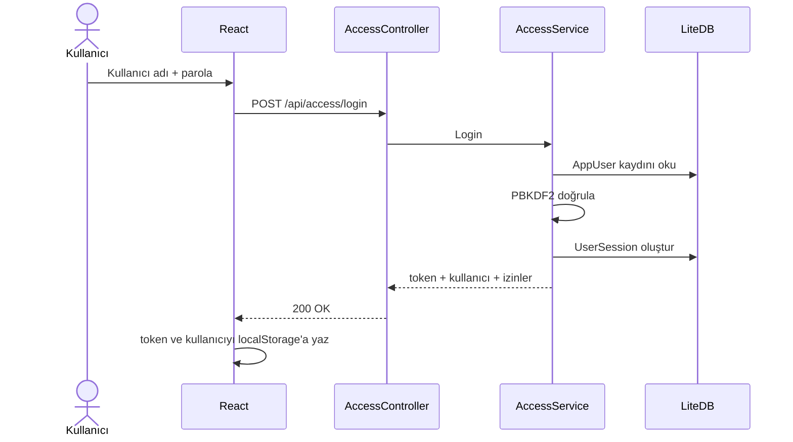

Bu giriş, FTP veya SFTP girişi değildir. Yalnızca web uygulamasına kim olduğunuzu söyler.

## 2. FTP bağlantısını doğrulama ve klasör listeleme

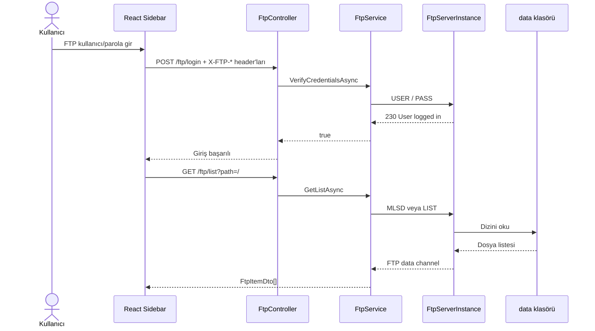

## 3. FTP neden iki bağlantı kullanır?

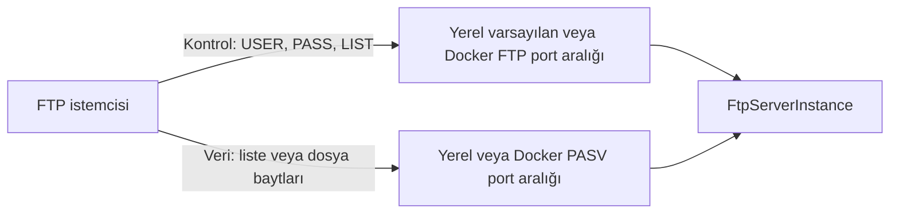

Yerel geliştirme varsayılanında kontrol portları `2121` ve devamı, pasif aralık `50000–51000` olur. Docker bu iki aralığı ilk başlangıçta boş host portlarından seçip `.docker/runtime.env` dosyasına kaydeder. Komut bağlantısı açık olsa bile pasif veri portları engellenirse giriş başarılı olur fakat listeleme/yükleme başarısız olur.

## 4. Küçük dosya yükleme

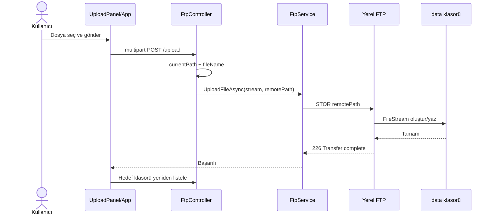

## 5. Büyük dosyada parçalı yükleme

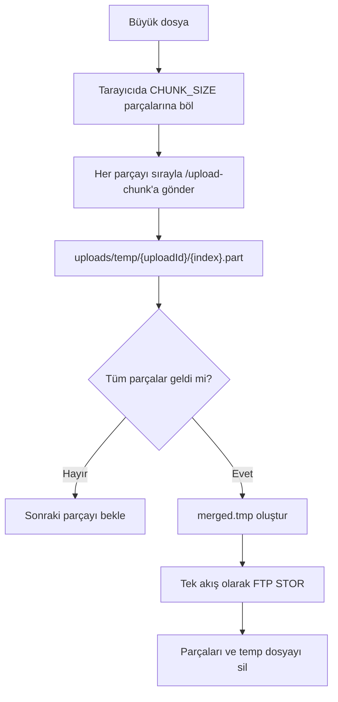

İptal veya hata durumunda `/cancel-upload`, ilgili geçici dosyaları temizler.

## 6. Seçilen yolun yükleme hedefine dönüşmesi

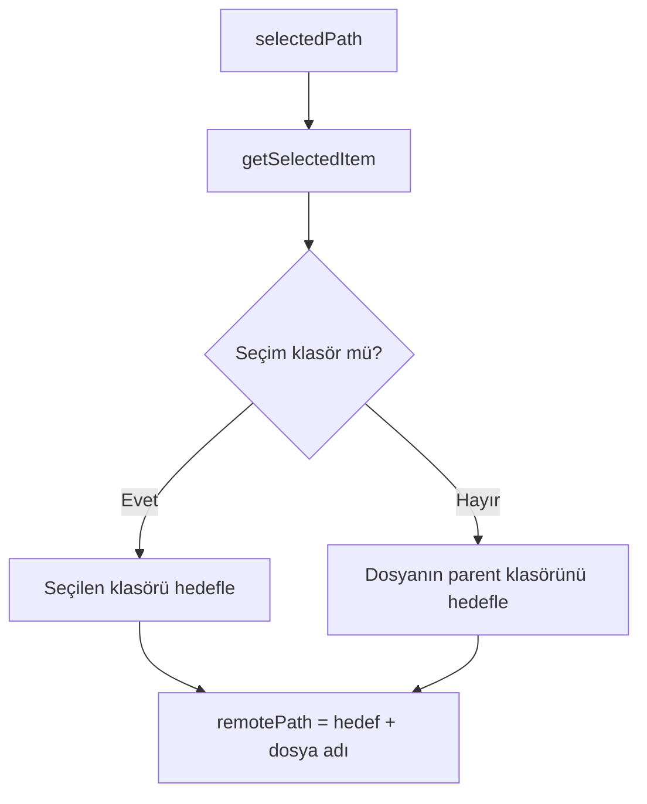

Bu kural, seçilmiş bir dosyanın yanlışlıkla klasör gibi kullanılmasını ve `dosya.pdf/yeni.txt` benzeri imkânsız yolları önler.

## 7. Taşıma ve yeniden adlandırma

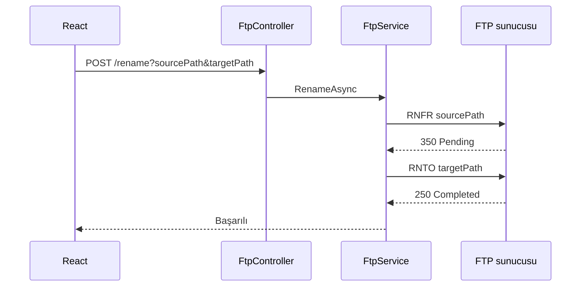

Sürükle-bırak taşıma ve manuel yeniden adlandırma aynı altyapıyı kullanır; yalnızca hedef yolun hesaplanması farklıdır.

## 8. Dosya önizleme

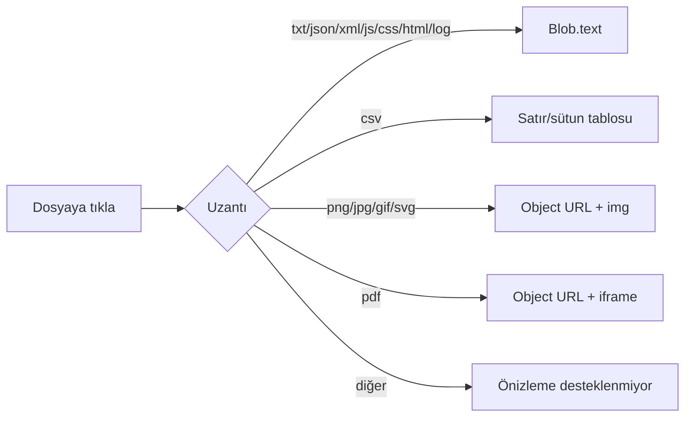

Önizleme de dosyayı FTP'den indirir. Görsel/PDF için oluşturulan object URL, panel kapanınca `URL.revokeObjectURL` ile temizlenir.

## 9. SFTP hazırlama

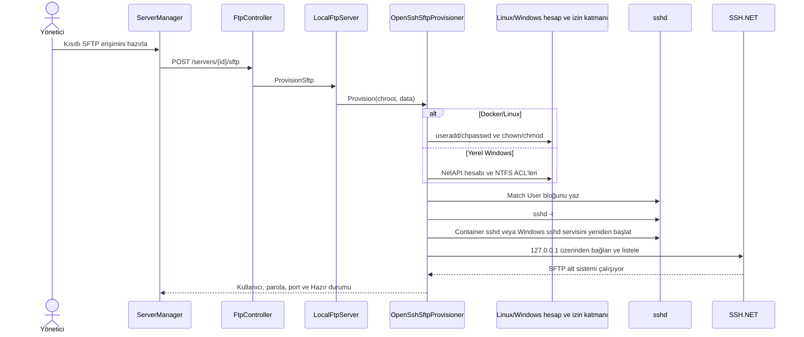

### Chroot izin resmi

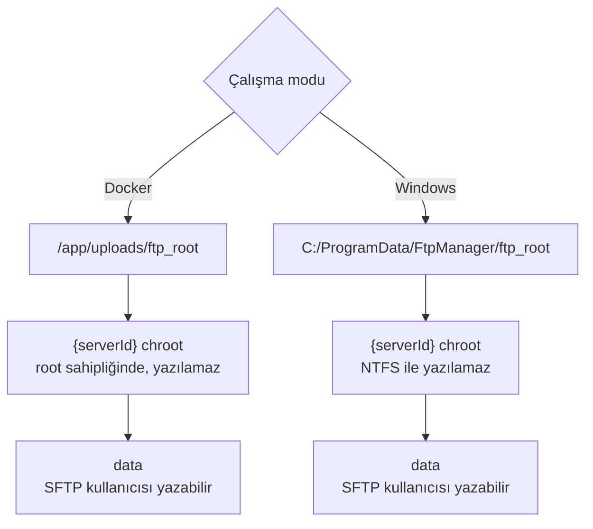

Bu nedenle FileZilla ile `/readme.txt` yüklemek reddedilir; doğru yazılabilir hedef `/data/readme.txt` olur.

## 10. ngrok dış erişimi

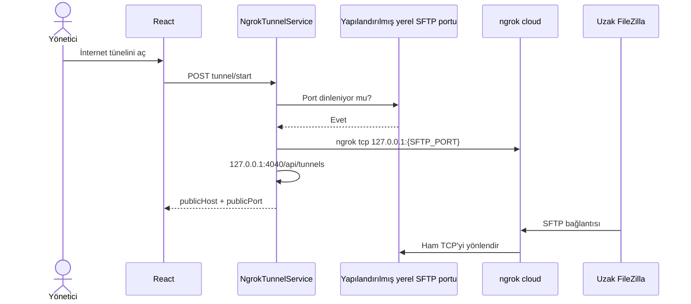

ngrok adresi bir web adresi gibi görünse de bağlantı protokolü HTTP değil, TCP üzerinden SSH/SFTP'dir.

## 11. FTP ve SFTP aynı dosyayı nasıl görür?

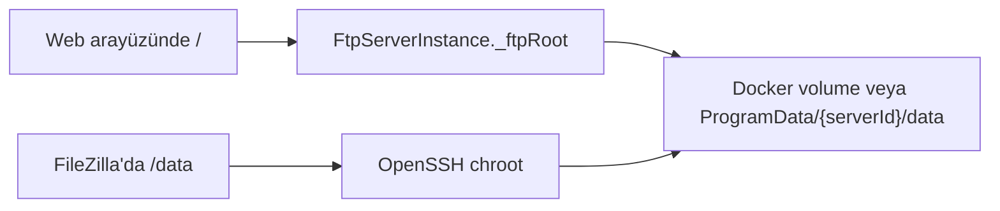

| İşlem | Sonuç |
| --- | --- |
| Arayüzden `/rapor.pdf` yükle | FileZilla `/data/rapor.pdf` görür |
| FileZilla `/data/resim.png` yükle | Arayüz `/resim.png` görür |
| FileZilla `/resim.png` yüklemeye çalış | Chroot kökü yazılamadığı için izin hatası |

## 12. Log akışı

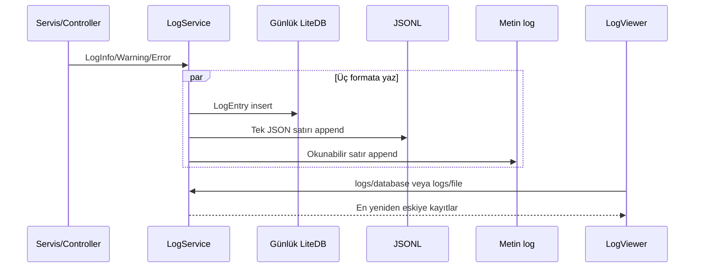
