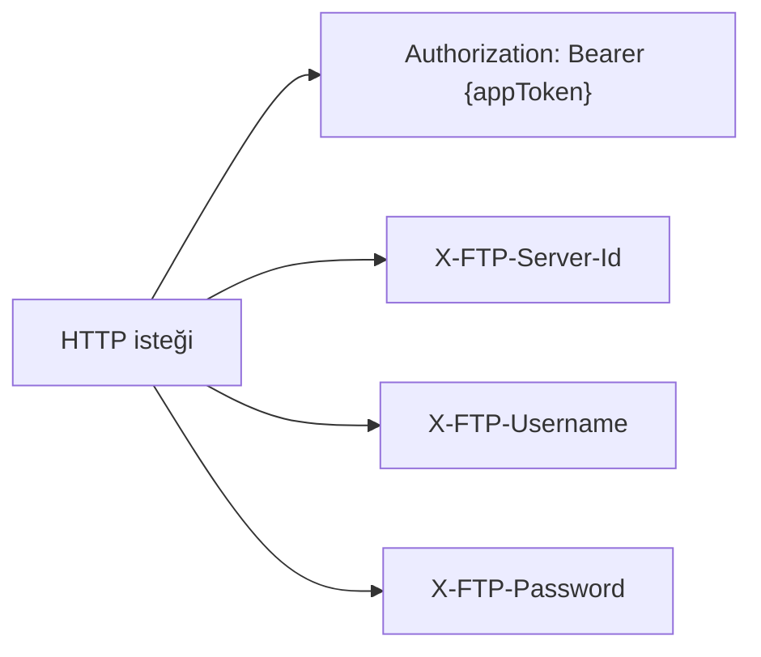
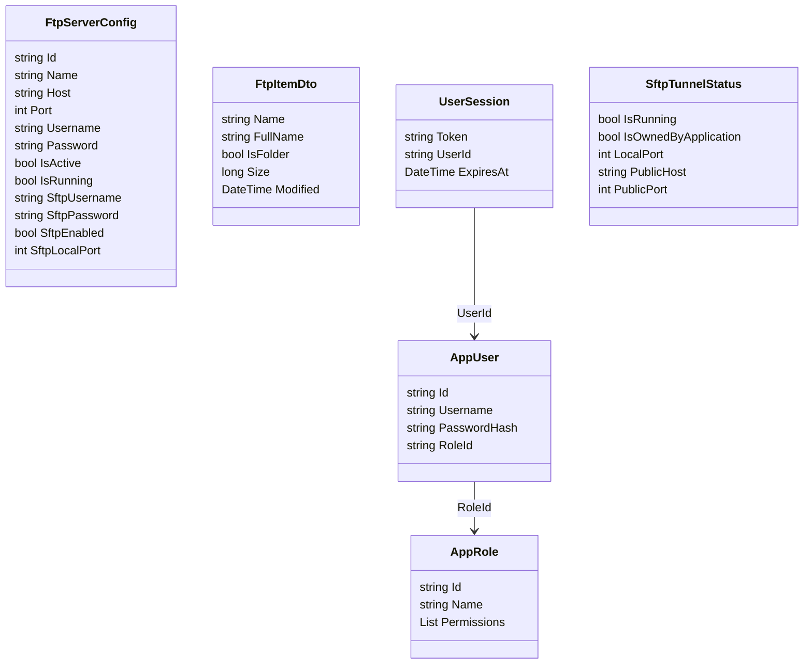
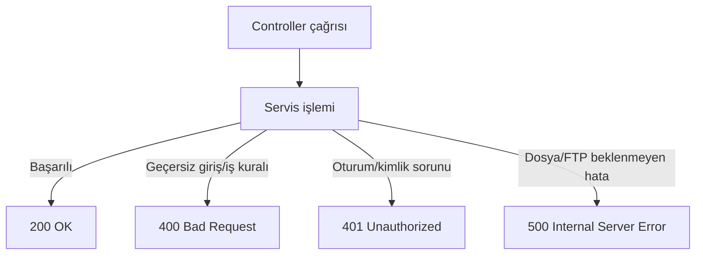

# API Referansı

## 1. Temel adresler

| Alan | Adres |
| --- | --- |
| FTP/dosya API | `http://localhost:5230/api/ftp` |
| Uygulama erişim API | `http://localhost:5230/api/access` |
| Frontend geliştirme | `http://localhost:5173` |

## 2. Kimlik header'ları



| Header | Amaç |
| --- | --- |
| `Authorization: Bearer <token>` | Uygulama kullanıcısı ve rol izinleri |
| `X-App-Token` | Bearer yerine desteklenen alternatif uygulama token header'ı |
| `X-FTP-Server-Id` | Yönetilen sunuculardan hangisinin seçildiği |
| `X-FTP-Username` | O FTP sunucusuna bağlanacak hesap |
| `X-FTP-Password` | O FTP sunucusunun parolası |
| `X-FTP-Host`, `X-FTP-Port` | Yönetilen sunucu kimliği verilmediğinde doğrudan uzak FTP hedefi |

## 3. Uygulama erişim endpoint'leri

| Metot | Yol | Görev | Gerekli izin |
| --- | --- | --- | --- |
| POST | `/api/access/login` | Uygulama oturumu aç | Yok |
| GET | `/api/access/me` | Güncel kullanıcı/izinleri getir | Geçerli token |
| GET | `/api/access/permissions` | İzin kataloğu | `access.manage` |
| GET | `/api/access/roles` | Rolleri listele | `access.manage` |
| POST | `/api/access/roles` | Rol oluştur | `access.manage` |
| PUT | `/api/access/roles/{id}` | Rol güncelle | `access.manage` |
| DELETE | `/api/access/roles/{id}` | Rol sil | `access.manage` |
| GET | `/api/access/users` | Kullanıcıları listele | `access.manage` |
| POST | `/api/access/users` | Kullanıcı oluştur | `access.manage` |
| PUT | `/api/access/users/{id}` | Kullanıcı güncelle | `access.manage` |
| DELETE | `/api/access/users/{id}` | Kullanıcı sil | `access.manage` |

## 4. Dosya endpoint'leri

| Metot | Yol | Parametre/gövde | Sonuç |
| --- | --- | --- | --- |
| GET | `/api/ftp/list` | Query: `path` | `FtpItemDto[]` |
| POST | `/api/ftp/upload` | Multipart: `file`, `currentPath` | Dosyayı doğrudan yükler |
| POST | `/api/ftp/upload-chunk` | Multipart: parça ve upload metadata | Parçayı kaydeder; son parçada birleştirir |
| POST | `/api/ftp/cancel-upload` | Query: `uploadId` | Geçici parçaları temizler |
| POST | `/api/ftp/rename` | Query: `sourcePath`, `targetPath` | Taşır veya yeniden adlandırır |
| GET | `/api/ftp/download` | Query: `remotePath` | `application/octet-stream` |
| DELETE | `/api/ftp/delete` | Query: `path`, `isFolder` | Dosya veya klasörü siler |
| POST | `/api/ftp/create-folder` | Query: `path` | Dizin oluşturur |
| POST | `/api/ftp/login` | Query: `username`, parola header'dan | FTP kimlik doğrulamasını test eder |

> Mevcut kodda bu endpoint'lerin tamamında backend seviyesinde `PermissionKeys.Files*` zorlaması yoktur. Üretim güvenliği için her endpoint'e uygun `RequirePermission` eklenmelidir.

## 5. Log endpoint'leri

| Metot | Yol | Kaynak |
| --- | --- | --- |
| GET | `/api/ftp/logs/file` | JSONL günlükleri |
| GET | `/api/ftp/logs/database` | Günlük LiteDB logları |

Mevcut arayüz `logs.view` izni yoksa bunları istemez; backend controller tarafında ayrıca zorunlu izin kontrolü eklenmesi önerilir.

## 6. FTP sunucu yönetimi

| Metot | Yol | Görev | Gerekli izin |
| --- | --- | --- | --- |
| GET | `/api/ftp/servers` | Sunucuları ve çalışma durumunu getir | `servers.view` |
| POST | `/api/ftp/servers` | Sunucu oluştur ve gerekirse başlat | `servers.manage` |
| DELETE | `/api/ftp/servers/{id}` | SFTP hesabı + instance + dosyaları kaldır | `servers.manage` |
| POST | `/api/ftp/servers/{id}/start` | FTP instance başlat | `servers.manage` |
| POST | `/api/ftp/servers/{id}/stop` | FTP instance durdur | `servers.manage` |
| POST | `/api/ftp/servers/{id}/sftp` | Kısıtlı SFTP hesabı hazırla | `servers.manage` |

`servers.credentials` izni olmayan kullanıcılarda FTP parolası boş, SFTP parolası `null` döndürülür.

## 7. ngrok/SFTP tünel endpoint'leri

| Metot | Yol | Görev | Gerekli izin |
| --- | --- | --- | --- |
| GET | `/api/ftp/sftp/tunnel?localPort=2222` | Tünel durumunu keşfet | `servers.view` |
| POST | `/api/ftp/servers/{id}/sftp/tunnel/start` | Sunucunun SSH portuna ngrok TCP aç | `servers.manage` |
| POST | `/api/ftp/sftp/tunnel/stop?localPort=2222` | Uygulamanın açtığı tüneli kapat | `servers.manage` |

## 8. Temel istek örnekleri

### Uygulama girişi

```http
POST http://localhost:5230/api/access/login
Content-Type: application/json

{
  "username": "admin",
  "password": "..."
}
```

### FTP kökünü listeleme

```http
GET http://localhost:5230/api/ftp/list?path=/
Authorization: Bearer APP_TOKEN
X-FTP-Server-Id: SERVER_ID
X-FTP-Username: FTP_USER
X-FTP-Password: FTP_PASSWORD
```

### Sunucu oluşturma

```http
POST http://localhost:5230/api/ftp/servers
Authorization: Bearer APP_TOKEN
Content-Type: application/json

{
  "name": "Arşiv",
  "host": "127.0.0.1",
  "port": 2123,
  "username": "archive",
  "password": "...",
  "isActive": true
}
```

### SFTP hazırlama

```http
POST http://localhost:5230/api/ftp/servers/SERVER_ID/sftp
Authorization: Bearer APP_TOKEN
```

## 9. Model ilişkileri



## 10. HTTP hata davranışı



