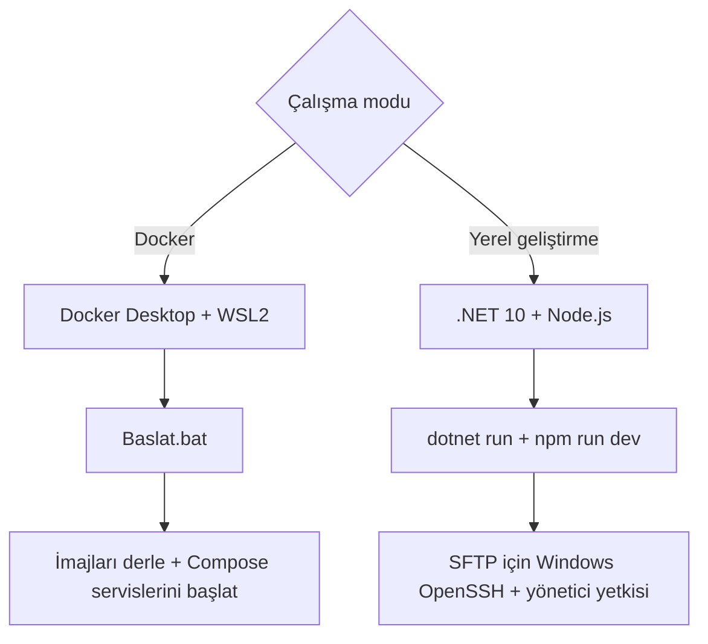
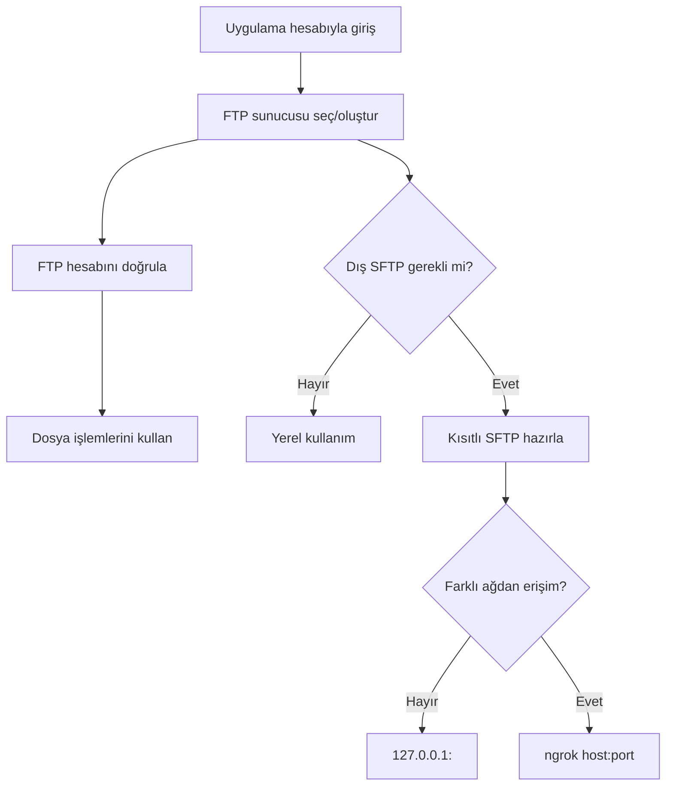
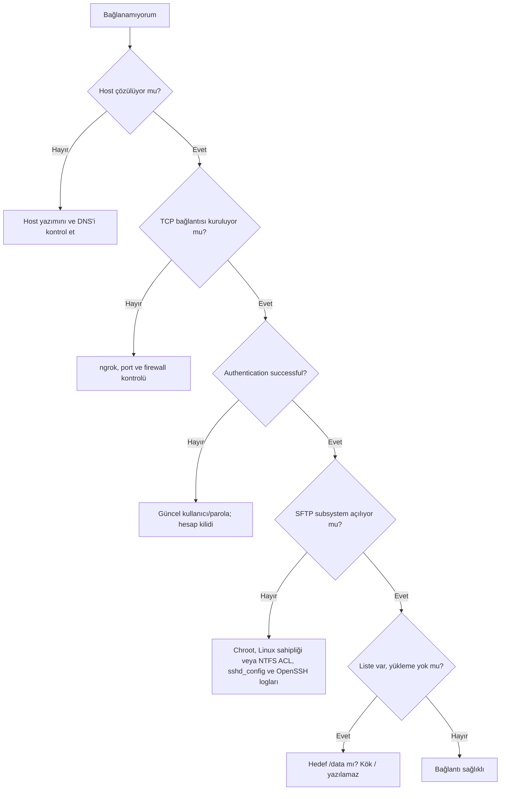
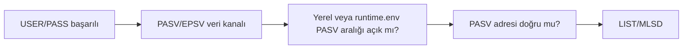
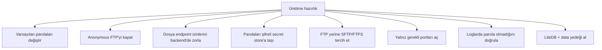

# Kurulum, İşletim ve Sorun Giderme

## 1. Gereksinimler

| Çalışma modu | Zorunlu | Yalnız SFTP/ngrok için |
| --- | --- | --- |
| Docker (önerilen) | Windows 10/11, WSL2 ve Docker Desktop | ngrok kullanılıyorsa `NGROK_AUTHTOKEN` |
| Yerel geliştirme | .NET SDK 10, Node.js 20+ ve npm | Windows OpenSSH Server, ngrok ve SFTP hazırlarken yönetici yetkisi |

Docker modunda .NET SDK, Node.js, OpenSSH ve ngrok hosta ayrıca kurulmaz; imajların içinde bulunur.

## 2. Kurulum resmi



## 3. Ortamı çalıştırma

### Docker ile normal kullanım

```powershell
.\Baslat.bat
```

Komut imajları güncel kaynak kodla yeniden derler, daha önce `.docker/runtime.env` içine ayrılan portları kullanır ve uygulamayı açar. Kod/imaj değişmediyse mevcut container çalışmaya devam eder; değişen servis varsa Compose o container'ı yenisiyle değiştirir. `ftp_manager_logs`, `ftp_manager_uploads` ve `ftp_manager_ssh` volume'leri korunur.

Durum ve loglar:

```powershell
.\scripts\docker.ps1 status
.\scripts\docker.ps1 logs
```

### Yerel geliştirme — backend

SFTP kullanacaksanız PowerShell'i **Yönetici olarak** açın:

```powershell
dotnet run --project .\Backend\FtpManager.Api
```

Beklenen adres:

```text
http://localhost:5230
```

### Yerel geliştirme — frontend

```powershell
cd .\Frontend
npm install
$env:VITE_API_ROOT = 'http://localhost:5230/api'
npm run dev
```

Beklenen adres:

```text
http://localhost:5173
```

## 4. İlk kullanım



## 5. Derleme ile çalışma testi arasındaki fark

| Komut | Neyi kanıtlar? | Neyi kanıtlamaz? |
| --- | --- | --- |
| `dotnet build` | C# kodu ve bağımlılıklar derleniyor | OpenSSH, ACL, port ve SFTP gerçekten çalışıyor |
| `npm run lint` | Frontend statik kalite kurallarını geçiyor | Kullanıcı akışları gerçekten çalışıyor |
| `npm run build` | Üretim frontend paketi oluşuyor | Backend ve ağ erişimi çalışıyor |
| `docker compose ... config --quiet` | Compose sözdizimi ve environment çözümlemesi geçiyor | Container süreçleri sağlıklı |
| `scripts/docker.ps1 start` + health | İmajlar ve container başlangıcı çalışıyor | Harici FTP/SFTP istemcisinin her ağdan erişimi |
| `dotnet run` normal kullanıcı | Temel API/FTP başlangıcı | Yönetici gerektiren SFTP provisioning |
| `dotnet run` yönetici + SFTP self-test | Windows hesap, ACL, sshd ve SFTP dizin listeleme | İnternetteki ngrok adresinin her istemciden erişimi |

## 6. FileZilla SFTP ayarı

| Alan | Değer |
| --- | --- |
| Protokol | `SFTP - SSH File Transfer Protocol` |
| Host | Arayüzdeki ngrok `publicHost` veya yerelde `127.0.0.1` |
| Port | ngrok `publicPort` veya yerel OpenSSH portu |
| Oturum türü | Normal |
| Kullanıcı | Sunucu kartındaki `sftpUsername` |
| Parola | Sunucu kartındaki güncel SFTP parolası |

Yazılabilir uzak dizin `/data`dır.

## 7. Sorun giderme karar ağacı



## 8. Sık hatalar

### Kod değişti fakat Docker arayüzünde görünmüyor

Sayfayı yenilemek kaynak kodu container'a kopyalamaz. `Baslat.bat` veya `.\scripts\docker.ps1 start` ile imajları yeniden derleyin. Bu kurulum hot reload/bind mount geliştirme modu değildir.

### Backend container `unhealthy` veya durmuş

```powershell
.\scripts\docker.ps1 status
docker compose --env-file .docker\runtime.env --file compose.yaml ps --all
docker compose --env-file .docker\runtime.env --file compose.yaml logs --tail 200 backend
```

Önce gerçek backend hatasını okuyun; yalnız frontend sayfasını yenilemek backend sürecini başlatmaz.

### `Host çözümlenemedi: abc`

`abc` gerçek DNS kaydı veya hosts girdisi değildir. Yerel sunucu için `127.0.0.1`, makinenin LAN IP'si veya gerçekten çözümlenen hostname kullanılmalıdır.

### `database is being used by another process`

LiteDB aynı dosyaya farklı bağlantı modlarıyla açılmış veya eski backend süreci çalışıyor olabilir. Mevcut servisler `Connection=shared` kullanır. Aynı portta ikinci backend çalıştırılmamalıdır.

### `net.exe zaman aşımı`

Eski yaklaşım dış `net.exe` sürecini bekliyordu. Güncel kod Windows NetAPI'yi doğrudan P/Invoke ile çağırır.

### `account is locked / 1909`

Yanlış parola tekrarları Windows hesabını kilitlemiştir. `WindowsLocalUserManager`, provisioning sırasında kilit/disable bayraklarını temizler ve `LogonUser` ile parolayı doğrular.

### `Authentication successful` ardından socket kapanıyor

Parola doğrudur; hata SFTP subsystem/chroot aşamasındadır. Kontrol sırası:

1. `sshd_config` içindeki kullanıcı Match bloğu.
2. Chroot kökünün yönetici/SYSTEM sahipliği.
3. SFTP kullanıcısının atalarda yalnızca read/traverse yetkisi.
4. `/data` üzerinde Modify yetkisi.
5. `ForceCommand internal-sftp -d /data`.

### `SSH_FX_PERMISSION_DENIED`

FileZilla hedefi `/readme.txt` ise güvenli köke yazmaya çalışıyorsunuz. Hedef `/data/readme.txt` olmalıdır.

### FTP girişi başarılı fakat listeleme başarısız



Komut portunun açık olması tek başına yeterli değildir. Pasif veri portları ve PASV cevabındaki IP de ulaşılabilir olmalıdır.

### ngrok adresine erişilemiyor

- Hostta `ngrok config add-authtoken ...` tamamlanmış mı ve `Baslat.bat` çıktısında token'ın yerel config'den yüklendiği görülüyor mu?
- Arayüzde veya `.docker/runtime.env` içinde gösterilen SFTP portu dinleniyor mu?
- `http://127.0.0.1:4040/api/tunnels` tüneli gösteriyor mu?
- Ücretsiz ngrok tüneli yeniden açılınca host/port değişmiş olabilir.

## 9. Tanılama komutları

### Docker

```powershell
.\scripts\docker.ps1 status
docker compose --env-file .docker\runtime.env --file compose.yaml ps --all
docker compose --env-file .docker\runtime.env --file compose.yaml logs --tail 200
Get-Content .\.docker\runtime.env
```

### Portlar

```powershell
Get-NetTCPConnection -State Listen |
  Where-Object LocalPort -in 5173,5230,2121,2122,2222 |
  Select-Object LocalAddress,LocalPort,OwningProcess
```

### Yerel Windows OpenSSH servisi

```powershell
Get-Service sshd
Get-WinEvent -LogName 'OpenSSH/Operational' -MaxEvents 30 |
  Select-Object TimeCreated,Id,Message
```

### sshd yapılandırma testi

```powershell
& "$env:WINDIR\System32\OpenSSH\sshd.exe" -t -f "$env:ProgramData\ssh\sshd_config"
```

### ngrok durumu

```powershell
Invoke-RestMethod http://127.0.0.1:4040/api/tunnels |
  ConvertTo-Json -Depth 6
```

### Backend doğrulama

Backend çalışırken varsayılan output kilitlenebileceği için ayrı klasöre derleyin:

```powershell
dotnet build .\Backend\FtpManager.Api\FtpManager.Api.csproj `
  -o .\artifacts\backend-build-check
```

## 10. Güvenlik kontrol listesi



## 11. Yedeklenecek alanlar

| İçerik | Konum |
| --- | --- |
| Docker sunucu/kullanıcı/rol veritabanı ve logları | `ftp_manager_logs` volume'ü (`/app/logs`) |
| Docker FTP/SFTP dosyaları | `ftp_manager_uploads` volume'ü (`/app/uploads`) |
| Docker OpenSSH anahtarları ve yapılandırması | `ftp_manager_ssh` volume'ü (`/etc/ssh`) |
| Yerel sunucu/kullanıcı/rol veritabanı | `Backend/FtpManager.Api/logs/database/ftp_manager.db` |
| Yerel günlük loglar | `Backend/FtpManager.Api/logs/` |
| Yerel asıl dosya deposu | `C:/ProgramData/FtpManager/ftp_root/` |
| Yerel OpenSSH ayarı | `C:/ProgramData/ssh/sshd_config` ve `.ftp-manager.bak` |

Container'ı kaldırmak named volume'leri silmez; buna rağmen volume kalıcılığı yedek yerine geçmez. Yalnız veritabanını yedeklemek dosyaları, yalnız `data` klasörünü yedeklemek kullanıcı/sunucu ayarlarını korumaz.
