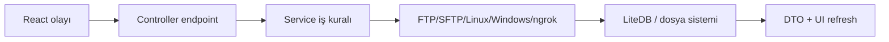
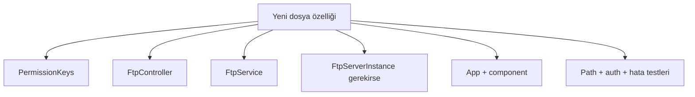
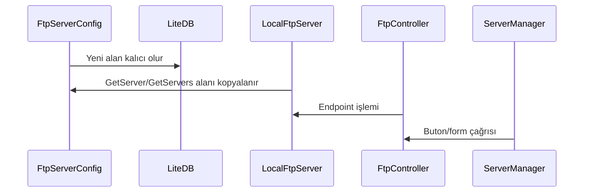
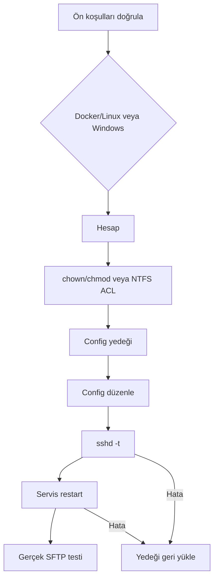
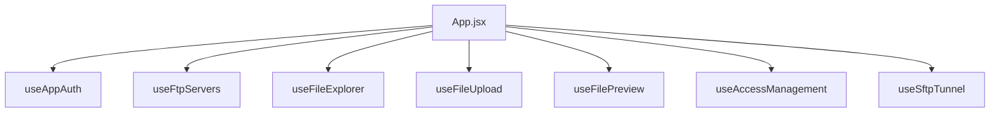
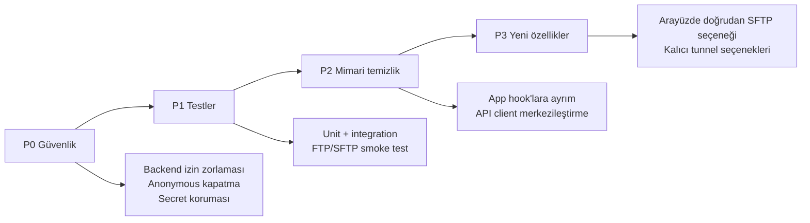

# Geliştirici Rehberi

## 1. Değişiklik yapmadan önce zihinsel model



Bir özellik bu zincirin kaç halkasına dokunuyor? Örneğin yalnız bir buton etiketi frontend işidir; yeni dosya operasyonu controller, service, FTP sunucusu ve izin modelini birlikte etkileyebilir.

## 2. Yeni dosya işlemi ekleme

Örnek: “dosya kopyala” özelliği.

1. Yerel FTP sunucusunun gerekli FTP komutunu destekleyip desteklemediğini değerlendirin.
2. `FtpService` içine istemci metodunu ekleyin.
3. `FtpController` endpoint'ini ve `files.modify` kontrolünü ekleyin.
4. `App.jsx` handler'ı ve uygun bileşen butonunu ekleyin.
5. Kaynak ve hedef yolları normalize edin; ikisinin de kök içinde kaldığını test edin.
6. Başarı/hata loglarını ekleyin.
7. UI listesini doğru parent klasörlerde yenileyin.



## 3. Yeni izin ekleme

1. `PermissionKeys` içine anahtar ve etiket ekleyin.
2. Hangi sistem rolünün varsayılan olarak alacağını belirleyin.
3. Controller'da `RequirePermission` kullanın.
4. Frontend'de `hasPermission` yalnız görünürlük/UX için kullanılsın.
5. Eski rollerin yeni izni otomatik alıp almayacağını migration olarak düşünün.

Kural: **Butonu saklamak güvenlik değildir. Güvenlik controller/service katmanında zorlanmalıdır.**

## 4. Yeni yönetilen sunucu özelliği ekleme



`GetServer` ve `GetServers` elle yeni DTO benzeri nesne oluşturduğu için modele alan eklediğinizde bu iki kopyalama noktasını unutmayın.

## 5. SFTP koduna dokunurken

SFTP provisioning işletim sistemi durumunu değiştirir. Docker'da Linux hesabı, sahiplik ve container sshd süreci; yerel modda Windows hesabı, NTFS ACL ve Windows sshd servisi etkilenir. Bu nedenle işlem sırası ve rollback önemlidir.



Yalnız `dotnet build` ile SFTP değişikliği tamamlanmış sayılmaz. En az şu üç seviye ayrı raporlanmalıdır:

1. Derleme geçti.
2. Hedef çalışma modunda provisioning geçti: Docker/Linux veya yönetici Windows.
3. SSH.NET/FileZilla ile dizin listeleme ve `/data` yükleme geçti.

## 6. ngrok koduna dokunurken

- Yerel port dinlenmeden tünel başlatmayın.
- Aynı porta ait mevcut tüneli önce keşfedin.
- Uygulamanın başlatmadığı süreci zorla öldürmeyin.
- Dış adresi stdout metninden tahmin etmek yerine ngrok API'sinden okuyun.
- ngrok adresinin geçici olduğunu UI'da açıkça gösterin.

## 7. Frontend state'i küçültme önerisi

Mevcut `App.jsx` zamanla şu hook'lara ayrılabilir:



Bu ayrım davranışı değiştirmeden test edilebilirliği ve okunabilirliği artırır.

## 8. Test matrisi

| Alan | Mutlu yol | Hata yolu | Güvenlik yolu |
| --- | --- | --- | --- |
| Uygulama auth | Doğru parola | Yanlış/parola, süresi dolmuş token | Rol izni yok |
| FTP auth | Doğru FTP hesabı | Yanlış hesap | Anonymous kapalı olmalı |
| Dosya yolu | Kök ve alt klasör | Var olmayan klasör | `../` ile kökten çıkamama |
| Yükleme | Küçük ve büyük dosya | Ağ kesintisi, iptal | Dosya adı/path enjeksiyonu |
| SFTP | `/data` liste/yükle | Kilitli hesap, bozuk config | Chroot köküne yazamama |
| Docker yaşam döngüsü | İlk start ve tekrar start | Backend unhealthy, port çakışması | Volume ve secret'ların imaja/Git'e sızmaması |
| ngrok | Tünel aç/kapat | ngrok yok, token yok | Harici süreci öldürmeme |
| Log | Üç formata yazma | DB kilidi/disk hatası | Parola loglamama |

## 9. Doğrulama komutları

```powershell
# Backend derleme
dotnet build .\Backend\FtpManager.Api\FtpManager.Api.csproj `
  -o .\artifacts\backend-build-check

# Frontend statik denetim ve üretim derlemesi
cd .\Frontend
npm run lint
npm run build

# Repo köküne dönüp Docker yapılandırmasını doğrulama
cd ..
docker compose --env-file .docker\runtime.env --file compose.yaml config --quiet

# Güncel kodla imajları derleme ve health kontrolü
.\scripts\docker.ps1 start
.\scripts\docker.ps1 status
```

Çalışan yerel backend varsayılan `bin` dosyalarını kilitleyebileceği için backend kontrolünde ayrı output klasörü kullanılır. Docker doğrulamasında yalnız imajın derlenmesi yeterli değildir; backend ve frontend health durumu ile kritik API çağrıları ayrıca kontrol edilir. `Baslat.bat` hot reload sağlamaz; kaynak değişikliğinden sonra yeniden çalıştırılması gerekir.

## 10. Kod inceleme kontrol listesi

- [ ] Endpoint uygun uygulama iznini backend'de zorluyor mu?
- [ ] Kullanıcı girdisi fiziksel yola dönüşüyorsa kök sınırı kontrol ediliyor mu?
- [ ] Parola/token loglara veya hata mesajına sızıyor mu?
- [ ] Süreç, stream, socket ve token handle'ları dispose/close ediliyor mu?
- [ ] Uzun işletim sistemi işlemlerinden önce LiteDB bağlantısı kapanıyor mu?
- [ ] Başarısız config değişikliği rollback ediliyor mu?
- [ ] UI başarıdan sonra doğru klasörü/veriyi yeniliyor mu?
- [ ] Derleme testi ile gerçek çalışma testi ayrı raporlandı mı?
- [ ] Kullanıcının mevcut dosyaları üzerine sessizce yazılıyor mu?
- [ ] Windows yolunda Türkçe karakter ve boşluk senaryosu düşünüldü mü?
- [ ] Docker/Linux yolu ile yerel Windows yolu ayrı ayrı değerlendirildi mi?
- [ ] Yeni port container içinde dinleniyor ve `compose.yaml` tarafından hosta eşleniyor mu?
- [ ] Kalıcı veri named volume'de mi, yoksa container yenilenince kayboluyor mu?
- [ ] Secret veya `.docker/runtime.env` Git'e ya da Docker build context'ine giriyor mu?

## 11. Önerilen geliştirme yol haritası


