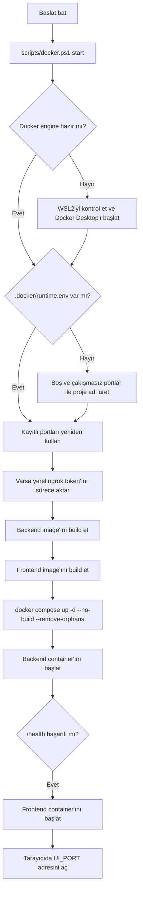
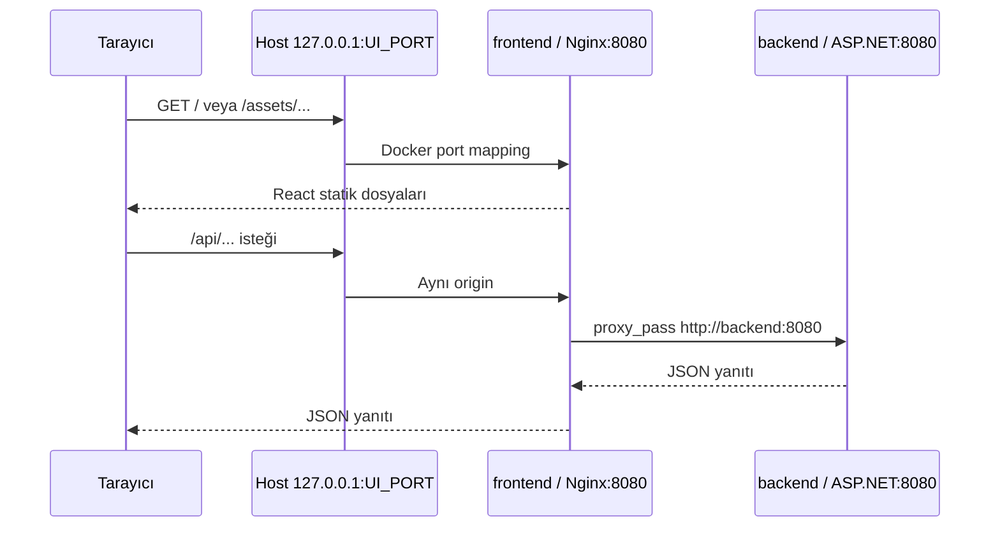

# Docker Kurulum ve İşletim Rehberi

Docker çalışma modu, projeyi hosta .NET SDK, Node.js veya OpenSSH kurmadan çalıştırmanın önerilen yoludur. React production paketi Nginx container'ında; ASP.NET Core API, yerel FTP instance'ları, Linux OpenSSH/SFTP ve ngrok agent'ı backend container'ında çalışır.

## Docker bu projede tam olarak nasıl çalışır?

Docker burada kaynak kodu doğrudan çalıştıran tek bir program değildir. Projenin ihtiyaç duyduğu ortamları **image** olarak paketler, bu image'ları **container** olarak çalıştırır ve iki servisi **Docker Compose** ile aynı ağ ve veri modeli altında yönetir.

| Kavram | Bu projedeki karşılığı |
| --- | --- |
| Image | Backend veya frontend'in çalışması için gereken kodu, runtime'ı ve araçları içeren salt-okunur paket |
| Container | Bir image'ın çalışan instance'ı; bu projede `backend-1` ve `frontend-1` |
| Compose projesi | Container'ları, `app` ağını ve named volume'leri tek grup olarak yöneten üst yapı |
| Bridge network | Frontend'in backend'e `backend:8080` adıyla ulaşmasını sağlayan, hosttan ayrı iç ağ |
| Port mapping | Hosttaki `127.0.0.1:<port>` trafiğini container içindeki porta ileten kural |
| Named volume | Container silinse bile veritabanını, dosyaları ve SSH anahtarlarını koruyan Docker depolaması |

### `Baslat.bat` çalıştırılınca gerçekleşen sıra



Adım adım karşılığı şöyledir:

1. `Baslat.bat`, proje klasörünü aktif dizin yapar ve `scripts/docker.ps1 start` komutunu çalıştırır.
2. Script `docker info` ile Docker engine'i kontrol eder. Engine kapalıysa WSL2'nin varlığını doğrular, Docker Desktop'ı başlatır ve en fazla iki dakika hazır olmasını bekler.
3. `.docker/runtime.env` yoksa aktif TCP portları taranır. UI, API ve SFTP için birer port; FTP kontrol bağlantıları için 10; pasif veri kanalları için 50 ardışık port seçilir. Klasör yolunun SHA-256 özetinden benzersiz bir Compose proje adı üretilir.
4. Runtime dosyası zaten varsa yeni port veya proje adı üretilmez; aynı stack ve aynı adresler kullanılır.
5. Ngrok token'ı environment veya bilinen yerel ngrok ayar dosyalarında aranır. Bulunan değer sadece başlatma sürecine aktarılır; runtime dosyasına yazılmaz.
6. `docker compose build backend` backend image'ını oluşturur. SDK katmanında proje restore ve publish edilir; daha küçük ASP.NET runtime katmanına yalnızca yayımlanmış uygulama, OpenSSH, `curl` ve ngrok alınır. SDK son image'da bulunmaz.
7. `docker compose build frontend` frontend image'ını oluşturur. Node katmanında `npm ci` ve Vite production build çalışır; son Nginx katmanına sadece `dist` çıktısı ve Nginx ayarı kopyalanır. Node.js son container'da bulunmaz.
8. Docker değişmeyen Dockerfile adımlarını ve dosyaları layer cache'den kullanır. Bu nedenle script iki image'ı da build etse bile değişmeyen build genellikle kısa sürer.
9. `docker compose up --detach --no-build --remove-orphans`; `app` bridge ağını, named volume'leri ve gereken container'ları oluşturur veya günceller. `--detach` servisleri arka planda bırakır; `--remove-orphans` artık Compose dosyasında olmayan eski servisleri temizler.
10. Backend `http://+:8080` üzerinde dinler. Compose, `/health` endpoint'i başarılı olana kadar backend'i sağlıklı saymaz. Frontend'deki `depends_on: condition: service_healthy` nedeniyle Nginx backend hazır olmadan başlatılmaz.
11. Servisler hazır olunca script UI, API, SFTP ve FTP portlarını terminale yazar ve tarayıcıda web arayüzünü açar.

### Bir web isteği hangi yolu izler?



Tarayıcı backend container'ına doğrudan gitmez. Önce hosttaki `UI_PORT` üzerinden Nginx'e ulaşır. Nginx statik React dosyalarını kendisi döndürür; `/api/` ile başlayan istekleri ise Docker'ın iç DNS'i sayesinde `backend:8080` adresine yollar. `API_PORT`, normal UI kullanımından çok doğrudan tanılama içindir.

### FTP, SFTP ve ngrok trafiği hangi yolu izler?

- **FTP kontrol kanalı:** FTP istemcisi `127.0.0.1:<atanan FTP portu>` adresine bağlanır. Docker bu portu backend container'ındaki aynı porta iletir; ASP.NET içindeki FTP server instance'ı komutları karşılar.
- **FTP pasif veri kanalı:** Dosya listesi veya transfer sırasında backend ayrı bir PASV/EPSV portu açar. Compose'taki 50 portluk mapping, istemcinin bu ikinci bağlantıyı da container'a kurabilmesini sağlar.
- **SFTP:** SFTP istemcisi hosttaki `SFTP_PORT` üzerinden backend container'ındaki Linux OpenSSH servisine ulaşır. Kullanıcı chroot ile sadece kendisine ayrılan klasörü görür.
- **Ngrok:** Arayüzde **Internet tünelini aç** düğmesine basılınca backend container'ı içindeki ngrok agent'ı yerel SFTP portuna TCP tüneli açar. `Baslat.bat` token'ı hazırlar fakat tüneli kendiliğinden açmaz.

Docker Desktop'ta backend satırında **62 port** görülmesi 62 ayrı uygulamanın çalıştığı anlamına gelmez. Sayı; 1 API + 1 SFTP + 10 FTP kontrol + 50 FTP pasif veri portu mapping'inin toplamıdır. Frontend ayrıca tek bir UI portu yayınlar.

### Veri neden container yenilenince kaybolmaz?

Container'ı geçici bir çalışma katmanı olarak düşünün. Image değişince Compose eski container'ı kaldırıp yenisini oluşturabilir. Kalıcı veriler container katmanında değil, aşağıdaki named volume'lerde tutulur:

```text
ftp_manager_logs   -> /app/logs   -> LiteDB, oturum/yetki verileri ve loglar
ftp_manager_uploads -> /app/uploads -> FTP ve SFTP dosyaları
ftp_manager_ssh    -> /etc/ssh    -> OpenSSH host anahtarları ve ayarları
```

`Durdur.bat`, `docker compose down` veya image/container yenilemesi bu volume'leri silmez. Ancak `docker compose down --volumes`, Docker Desktop'tan volume silme veya `docker volume rm` kalıcı verileri yok eder. Named volume bir yedekleme sistemi değildir.

### Hangi değişiklik neyi yeniler?

| Değişiklik | Sonraki `Baslat.bat` davranışı |
| --- | --- |
| `Frontend/src` | Frontend image yeniden build edilir; frontend container gerekiyorsa yenilenir |
| Backend `.cs` dosyaları | Backend publish/build katmanları yenilenir; backend container yenilenir |
| `package.json` / lock dosyası | `npm ci` katmanı yeniden çalışır |
| `.csproj` | `dotnet restore` ve publish katmanları yeniden çalışır |
| Dockerfile veya `compose.yaml` | Etkilenen image ya da container yapılandırması yenilenir |
| Sadece tarayıcı yenileme | Image veya container değişmez; yeni kaynak kod yansımaz |
| Sadece container restart | Aynı image yeniden çalışır; VS Code'daki yeni kod image'a girmez |

Bu production düzeninde kaynak klasörleri container'a bağlanmadığı için hot reload yoktur. Kod değişikliğinin Docker'a girmesi için build gerekir; bu projede build ve güvenli Compose güncellemesi `Baslat.bat` tarafından birlikte yapılır.

## 1. Tek tıkla başlatma

1. Docker Desktop ve WSL2'yi kurun. WSL yoksa yönetici PowerShell'de `wsl --install` çalıştırıp bilgisayarı yeniden başlatın.
2. Proje kökündeki `Baslat.bat` dosyasına çift tıklayın.
3. İlk imaj derlemesinin tamamlanmasını bekleyin.
4. Açılan tarayıcıda `admin` / `admin123` ile giriş yapın ve parolayı değiştirin.

Başlatıcı Docker Desktop kapalıysa uygulamayı açmayı dener ve engine'in hazır olması için en fazla iki dakika bekler. İlk çalıştırmada boş portlar seçilir, `.docker/runtime.env` oluşturulur, imajlar sırayla derlenir, Compose servisleri başlatılır ve UI adresi açılır.

Terminal karşılığı:

```powershell
.\scripts\docker.ps1 start
```

## 2. Tekrar başlatınca ne olur?

`Baslat.bat` her çalıştırmada aynı klasör yolundan türetilen Compose proje adını ve aynı `.docker/runtime.env` dosyasını kullanır. Her seferinde yeni ve bağımsız bir proje yığını oluşturmaz.

- Kaynak veya imaj değişmediyse mevcut container çalışmaya devam eder.
- Backend ya da frontend imajı değiştiyse Compose yalnızca ilgili container'ı yenisiyle değiştirir.
- Container kimliği değişebilir; servis ve container adı aynı Compose projesi altında kalır.
- Named volume'ler container'dan bağımsız olduğu için veritabanı, loglar, dosyalar ve SSH anahtarları korunur.
- `.docker/runtime.env` silinmedikçe host portları aynı kalır.

## 3. Kod değişiklikleri otomatik yansır mı?

Hayır. Production Docker düzeninde kaynak klasörleri container'a bind mount edilmez ve hot reload yoktur. Kod, imaj oluşturulurken kopyalanır.

VS Code'da `.jsx`, `.js` veya `.cs` dosyası değiştirdikten sonra:

```powershell
.\Baslat.bat
```

komutunu yeniden çalıştırın. Yalnız tarayıcıyı yenilemek eski imajdaki kodu değiştirmez. `package.json`, `.csproj`, Dockerfile veya Compose değişikliklerinde de aynı yeniden derleme gerekir.

## 4. Port stratejisi

`scripts/docker.ps1`, bilgisayardaki aktif TCP dinleyicilerini okuyup `20000–60000` arasından şu kaynakları ayırır:

| Kaynak | Ayrılan port |
| --- | --- |
| Web arayüzü | 1 benzersiz port |
| API tanılama erişimi | 1 benzersiz port |
| SFTP | 1 benzersiz port |
| FTP kontrol bağlantıları | 10 portluk aralık |
| FTP PASV/EPSV veri kanalları | 50 portluk aralık |

Bütün eşlemeler varsayılan olarak yalnızca `127.0.0.1` üzerinde yayınlanır. Seçimler `.docker/runtime.env` içinde saklanır ve sonraki başlatmalarda aynen kullanılır. Farklı klasörlerdeki proje kopyaları, klasör yolundan üretilen ayrı Compose proje adları ve boş port taraması sayesinde birbirinden izole çalışabilir.

Yeni FTP sunucusu eklerken port alanını boş bırakabilirsiniz. Backend ayrılan 10 portluk Docker aralığındaki ilk kullanılmayan portu seçer. Elle port girilecekse değer aynı aralıkta ve diğer sunuculardan farklı olmalıdır.

Portları bilerek yeniden üretmek için önce stack'i durdurun, `.docker/runtime.env` dosyasını silin ve yeniden başlatın. LiteDB'de eski FTP portları kayıtlıysa bunları yeni aralığa taşımanız gerekir; normal kullanımda runtime dosyasını silmeyin.

## 5. Servis, ağ ve veri modeli

| Bileşen | Container içi adres/konum | Host erişimi veya kalıcılık |
| --- | --- | --- |
| Frontend/Nginx | `frontend:8080` | `127.0.0.1:<UI_PORT>` |
| ASP.NET Core API | `backend:8080` | Nginx `/api` proxy'si ve `127.0.0.1:<API_PORT>` |
| LiteDB ve loglar | `/app/logs` | `ftp_manager_logs` volume'ü |
| FTP/SFTP dosyaları | `/app/uploads` | `ftp_manager_uploads` volume'ü |
| OpenSSH anahtarları/yapılandırması | `/etc/ssh` | `ftp_manager_ssh` volume'ü |

Nginx `/api` isteklerini Docker ağındaki `backend:8080` adresine proxy eder. Tarayıcı UI ve API için aynı origin'i kullandığından sabit `localhost:5230` adresine veya geniş bir production CORS kuralına ihtiyaç yoktur.

`Durdur.bat` ve `docker.ps1 stop`, container'ları ve Compose ağını kaldırır fakat named volume'leri silmez. Volume kalıcılığı yedek değildir; önemli verileri ayrıca yedekleyin.

## 6. Yönetim komutları

```powershell
# Güncel kodla imajları derle ve servisleri başlat
.\scripts\docker.ps1 start

# Container ve health durumlarını gör
.\scripts\docker.ps1 status

# Canlı logları izle
.\scripts\docker.ps1 logs

# Container'ları kaldır; named volume'leri koru
.\scripts\docker.ps1 stop

# Çözülmüş Compose yapılandırmasını gör
.\scripts\docker.ps1 config
```

Daha ayrıntılı tanılama:

```powershell
docker compose --env-file .docker\runtime.env --file compose.yaml ps --all
docker compose --env-file .docker\runtime.env --file compose.yaml logs --tail 200 backend
Get-Content .\.docker\runtime.env
```

## 7. SFTP ve ngrok

Docker modunda her FTP sunucusu için chroot ile sınırlı bir Linux OpenSSH kullanıcısı oluşturulur. Kullanıcı yalnızca ilgili sunucunun `data` klasörüne yazabilir. OpenSSH backend container'ında çalıştığı için FTP ve SFTP aynı `ftp_manager_uploads` volume'ünü görür.

Ngrok agent'ı backend imajına dahildir. Başlatıcı token'ı şu sırayla arar:

1. Geçerli süreçteki `NGROK_AUTHTOKEN` environment değişkeni.
2. Standart ngrok config konumları.
3. Microsoft Store ngrok paketinin sanallaştırılmış config konumu.

Token mevcut ngrok config'inde kayıtlıysa `Baslat.bat` bunu otomatik bulup yalnızca başlatma sürecinde container'a aktarır; token ekrana, `.docker/runtime.env` dosyasına veya proje dosyalarına yazılmaz. Ngrok henüz yapılandırılmadıysa hostta bir kez çalıştırın:

```powershell
ngrok config add-authtoken <TOKEN>
.\scripts\docker.ps1 start
```

İsterseniz config yerine yalnız geçerli PowerShell oturumu için `$env:NGROK_AUTHTOKEN` tanımlayabilirsiniz. Değer container'a normal bir environment değişkeni olarak aktarılır; Docker secret nesnesi değildir. Token'ı `.docker/runtime.env`, `compose.yaml`, Git veya ekran görüntülerine yazmayın.

## 8. Git ve Docker build context sınırları

`.gitignore` şu yerel/üretilen içerikleri paylaşım dışında bırakır:

- `.docker/runtime.env`
- `Tests/`, `artifacts/` ve test dosyaları
- `bin/`, `obj/`, `dist/` ve `node_modules/`
- Backend log, veritabanı ve upload klasörleri

`.dockerignore` da `.docker/`, testler, bağımlılıklar, derleme çıktıları, yerel agent/IDE klasörleri, loglar ve upload'ları build context dışında tutar. Böylece yerel portlar, veritabanları, test çıktıları ve geliştirme dosyaları imaj katmanlarına kopyalanmaz.

## 9. Sorun giderme

- **Docker Desktop iki dakika içinde hazır olmadı:** Docker Desktop'ı açıp engine durumunu kontrol edin, ardından tekrar başlatın.
- **`port is already allocated`:** `.docker/runtime.env` içindeki bir port sonradan başka süreç tarafından alınmıştır. Önce çakışan süreci kapatın; kalıcı FTP kayıtları nedeniyle runtime dosyasını ilk çözüm olarak silmeyin.
- **Backend `unhealthy` veya durmuş:** `ps --all` ve backend loglarıyla gerçek başlangıç hatasını okuyun. Frontend sayfasını yenilemek backend'i başlatmaz.
- **Kod değişikliği görünmüyor:** `Baslat.bat` ile imajları yeniden derleyin; bu yapı hot reload kullanmaz.
- **FTP girişi var ama listeleme yok:** İstemcide pasif modu açın ve runtime dosyasındaki PASV port aralığını kontrol edin.
- **SFTP hazırlama başarısız:** Backend logunda `sshd -t`, Linux kullanıcı hesabı, chroot veya klasör sahipliği hatasını arayın.
- **Yetki ekranı oturum hatası gösteriyor:** Önce `/api/access/me`, `/users`, `/roles` ve `/permissions` durumlarını ayrı ayrı kontrol edin; tek endpoint'in iç hatasını genel oturum problemi sanmayın.

## 10. Güvenlik notları

- Varsayılan `admin123` parolasını ilk girişten sonra değiştirin.
- FTP parolaları şifresiz protokol üzerinden taşınabilir; güvenilmeyen ağlarda SFTP veya FTPS kullanın.
- Varsayılan host eşlemeleri yalnızca loopback'e açıktır; proje kendiliğinden LAN'a veya internete yayınlanmaz.
- LAN/public erişim için PASV adresi, NAT, firewall, DNS ve TLS/SFTP güvenliği ayrıca tasarlanmalıdır.
- Docker socket'i container'lara bağlanmaz; backend host Docker daemon'ını yönetemez.
- Named volume'lerin düzenli harici yedeğini alın.
