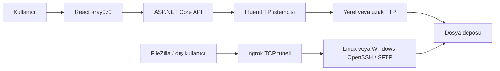

# FTP Dosya Yönetimi — Eğitim ve Teknik Dokümantasyon Merkezi

Bu klasör, projeyi ilk kez gören birinin sistemi yalnızca çalıştırmasını değil, **neden bu şekilde tasarlandığını anlayarak geliştirebilmesini** amaçlar. Belgeler hem önerilen Docker çalışma modunu hem de yerel Windows geliştirme modunu ayrı ayrı açıklar; hedef mimari ile mevcut gerçek durum birbirine karıştırılmaz.

## Okuma sırası

| Sıra | Belge | Ne öğretir? |
| --- | --- | --- |
| 1 | [Docker Kurulum ve İşletim Rehberi](07_DOCKER_KURULUMU.md) | Image, container, Compose, build, ağ, port, volume ve tek tıklama başlatma akışını uçtan uca açıklar |
| 2 | [Sistem Mimarisi](01_SISTEM_MIMARISI.md) | Büyük resim, Docker/yerel mod ayrımı, FTP–SFTP–ngrok ilişkisi ve depolama modeli |
| 3 | [Kod ve Servis Rehberi](02_KOD_VE_SERVIS_REHBERI.md) | Backend ve frontend içindeki her kaynak dosyanın sorumluluğu |
| 4 | [Akışlar ve Protokoller](03_AKISLAR_VE_PROTOKOLLER.md) | Giriş, listeleme, yükleme, SFTP hazırlama ve dış erişimin adım adım akışı |
| 5 | [API Referansı](04_API_REFERANSI.md) | Docker ve yerel adresler, endpoint, header, model ve izin eşleştirmeleri |
| 6 | [Kurulum, İşletim ve Sorun Giderme](05_KURULUM_ISLETIM_VE_SORUN_GIDERME.md) | Docker ve yerel kurulum, günlük kullanım, güvenlik ve hata teşhis karar ağaçları |
| 7 | [Geliştirici Rehberi](06_GELISTIRICI_REHBERI.md) | Yeni özellik ekleme, test etme ve güvenli değişiklik yapma yöntemi |

## Bir cümlede sistem

React arayüzü ASP.NET Core API ile konuşur; API, FluentFTP üzerinden seçilen FTP sunucusuna bağlanır veya kendi yerel FTP sunucularını çalıştırır. Aynı dosya deposu Docker'da Linux OpenSSH, yerel Windows modunda Windows OpenSSH aracılığıyla SFTP olarak paylaşılabilir; ngrok ise bu SFTP portuna internetten ulaşılabilen geçici bir TCP adresi verir.

## Üç ayrı kimlik doğrulama vardır

Yeni başlayanların en sık karıştırdığı nokta budur:

1. **Uygulama hesabı:** Web paneline girer; rol ve izinleri belirler.
2. **FTP hesabı:** Arayüzün seçilen FTP sunucusuna bağlanmasını sağlar.
3. **SFTP hesabı:** FileZilla gibi dış istemcilerin OpenSSH üzerinden güvenli dosya aktarımı yapmasını sağlar.

Bu hesapların kullanıcı adları ve parolaları birbirinden bağımsızdır.
